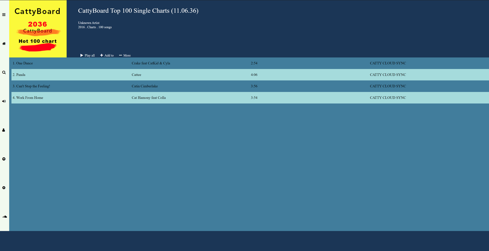
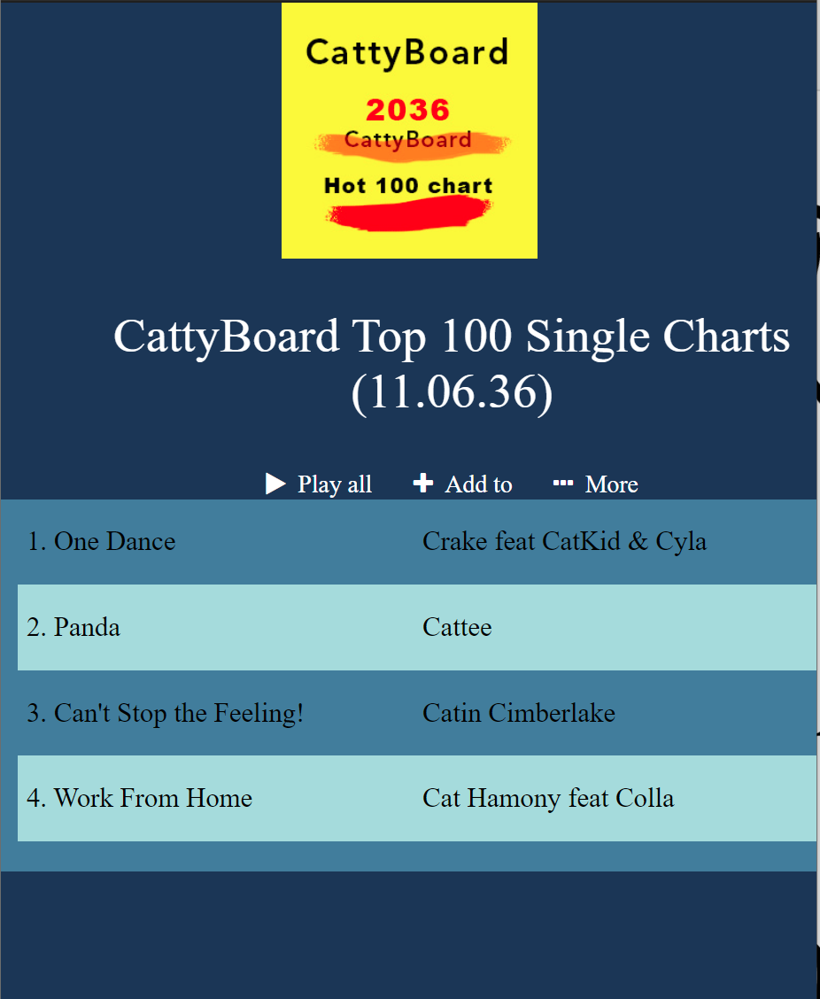

Project to learn how to use CSS grid and Flexbox together. In this project I designed the UI to a music streaming software/service. Also learnt how to use @media queries to set styles specifically for Mobile devices vs large screen devices

Some notes:
* Rule of thumb, use CSS grid to layout overall page layout but use Flexbox for inner components
* A grid item can be a flexbox container and a flexbox item can be a grid container

