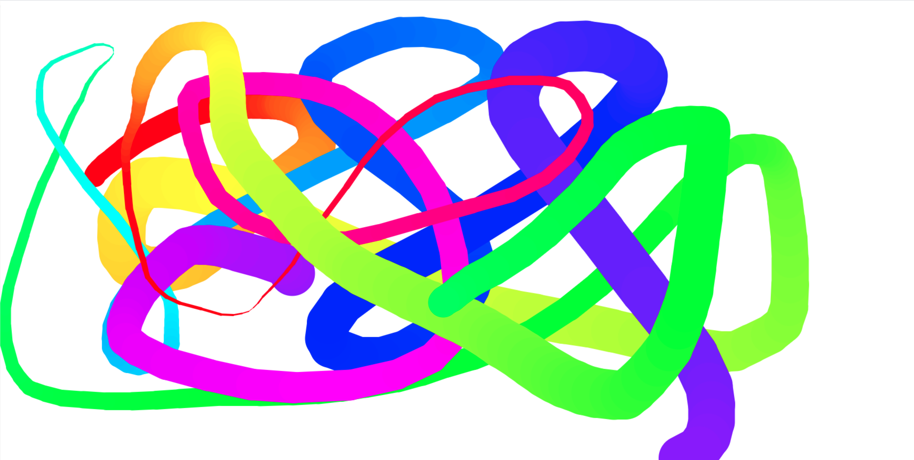

Challenge 7 - HTML Canvas

	• A canvas tag is used to dedicate pixels for drawing purposes
		○ <canvas></canvas>
		○ You can define the height and width attributes by defining these as properties
			§ <canvas height = "800" width = "800"></canvas>
		○ In order to actually draw stuff on the canvas you need to manipulate the canvas Context
			§ Context = canvas.getContext('2d')
				□ 2d if you are doing 2D drawing
		○ For drawing
			§ Context.beginPath() //Initiates the drawing
			§ Context.moveTo(x, y) //This is where you want the drawing to begin
			§ Context.lineTo (x,y) This is where the line will end
			§ Context.stroke() // This will actually draw the actual line based on the above setup/parameters
		○ You can select the line width, color, and endpoint shapes as follows
			§ Context.strokeStyle() // Sets the line color
			§ Context.lineJoin = 'Round' will join 2 lines with round endpoints
			§ Context.lineCap = 'Round' will set the line Cap to Round
			§ Context.lineWidth = 40 will set the line width to 40
	• In this project we also learnt a really cool API called HSL
		○ This can be used to programmatically select colors from the rainbow spectrum
		○ We use this to dynamically change the strokeStyle of the line based on a JavaScript variable
	• A key concept/mechanic we used in this project is to emulate the drawing ONLY when the user clicks and drags. In order to do this, we need to add an Event listener on the canvas for 4 different mouse gestures
		○ We have to draw when mousedown && mousemove
		○ We have to disable drawing when mouseup and mouseout
    Mouseout because if we press down and leave the canvas and come back in, then it should not start drawing again when we are back on the canvas  
    
    
    
