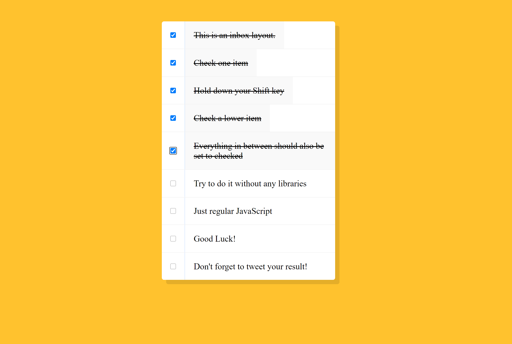

Project 9 - Multiple CheckBox

	• The key concept in this project is to understand how the code will keep track of the last checked input checkbox
	• In order to do this, be ALWAYS save the last checked input checkbox in a variable called lastChecked
	• The portion of the code that we need to add to handle the 'SHIFT click' scenario ONLY applies when a the shift key is pressed (and held) and when the checkbox is being Checked
		○ This is done in the main if block of the handler function that each checkbox will run as part of event listening on 'click'
			§ Better to use 'click' instead of 'change' because 'click' will also account for keyboard input
Important to understand that inside the eventlistener handler, you can still iterate of the input checkbox DOM elements

