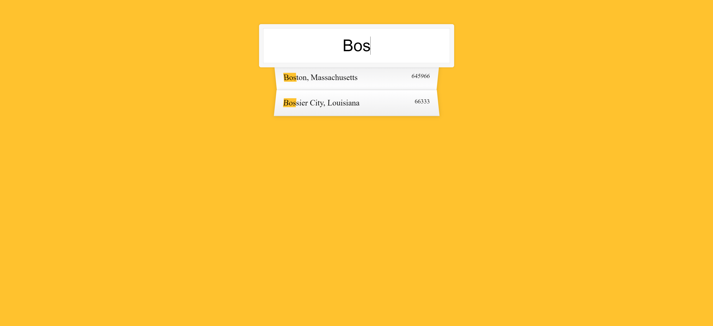

Challenge 5 - Ajax type Ahead

	• Terms that need to be researched and studied
		○ Fetch API
		○ Promise
		○ What is the '.then()' [dot then]
		○  '…' known as spread
			§ Usually done within a function call to make sure that the array returned are the individual array values and so it does not save as an array of an array basically
		○ Regexp()
			§ Used for matching text with a pattern

